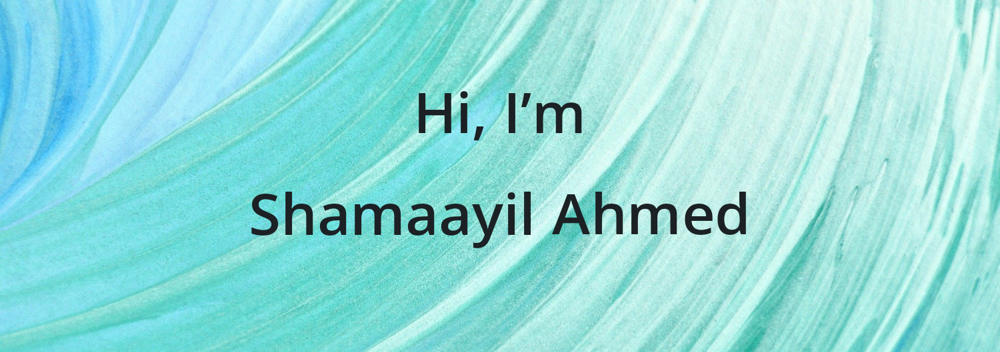

Hey there 👋

I’m Shamaayil, a frontend engineer, intuitive problem solver and self-proclaimed developer who specializes in front-end development using JavaScript paradigm. Builds good websites or applications from user-focused design orients.

Want to know more about me? [Check out my portfolio](https://shamaayilahmed.tech/)

 

# 📩 Latest Blog Posts
<!-- BLOG-POST-LIST:START -->
- [React Hook #3 useRef()](https://shamaayil.hashnode.dev/react-hook-3-useref)
- [Forms in ReactJS](https://shamaayil.hashnode.dev/forms-in-reactjs)
- [Conditional Rendering in ReactJS](https://shamaayil.hashnode.dev/conditional-rendering-in-reactjs)
- [React Hook #2 useEffect()](https://shamaayil.hashnode.dev/react-hook-2-useeffect)
- [React Hook #1 useState()](https://shamaayil.hashnode.dev/react-hook-1-usestate)
<!-- BLOG-POST-LIST:END -->

 

# 📌 Pinned Repositories

 

# 📊 GitHub Stats

 

## 💼 Skills

<!--

-->

More Skills

 
  

<!--
**shamaayilahmed/shamaayilahmed** is a ✨ _special_ ✨ repository because its `README.md` (this file) appears on your GitHub profile.

Here are some ideas to get you started:

- 🔭 I’m currently working on ...
- 🌱 I’m currently learning ...
- 👯 I’m looking to collaborate on ...
- 🤔 I’m looking for help with ...
- 💬 Ask me about ...
- 📫 How to reach me: ...
- 😄 Pronouns: ...
- ⚡ Fun fact: ...
-->
